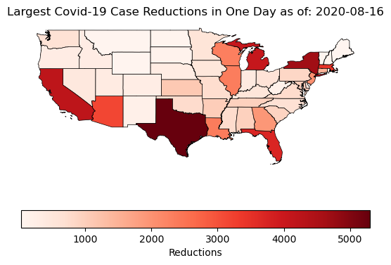
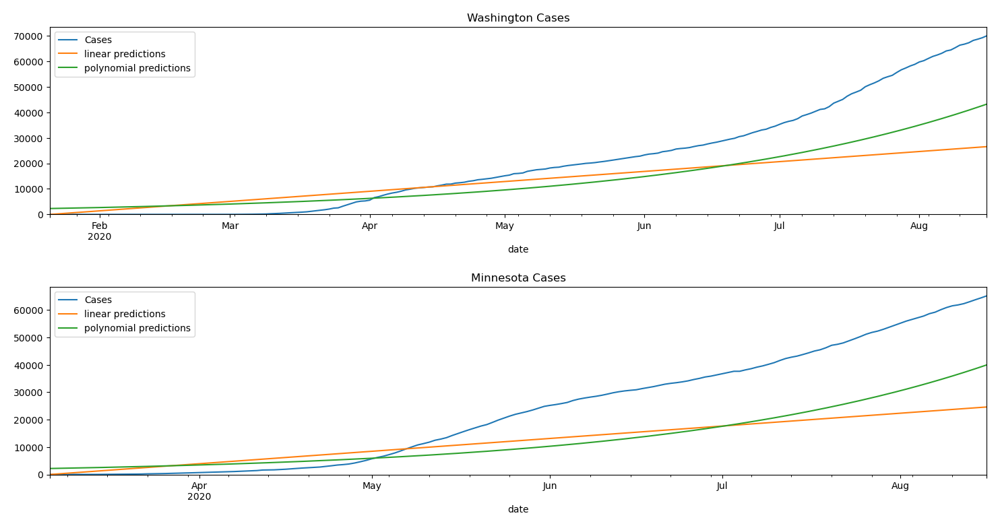
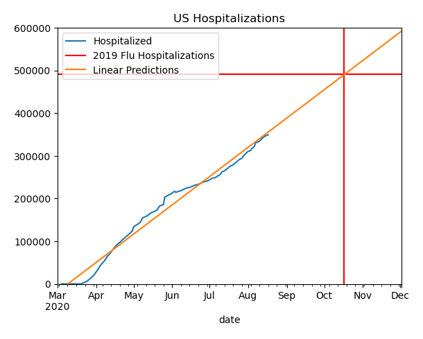

# Exploring Covid-19’s Implications in the US

*This program generates various visualizations and regression models regarding the Covid-19 Pandemic in the US.*
By @Guitajun and @danielqiang

Requires Python 3.7 or later.
## Dependencies

[Requests](https://pypi.org/project/requests/), 
[Pandas](https://pandas.pydata.org/),
[GeoPandas](https://geopandas.org/),
[scikit-learn](https://scikit-learn.org/stable/). 

## Generate Research Results
1. Clone and download [our repository](https://github.com/danielqiang/cse163-project)
2. Install required dependencies
3. Run `main.py` to generate result visualizations (result graphs will be saved to `results` directory)

   
## Covid-19 Visualizations
Uses continuously updated data sets from [this NYTimes repository](https://github.com/nytimes/covid-19-data) and [the COVID Tracking Project](https://covidtracking.com/) (will be converted to API) in order to showcase (relatively) real-time data visualizations about the Covid-19 Pandemic.
1. Run `project.py` to generate visualization maps

## Examples:

